# Fairfield House Network Infrastructure
## Budget-Optimized Configuration

**Project Status:** Phase 1 Complete - Budget Design Finalized
**Total Investment:** £3,899 (Refined Budget Configuration)
**Date:** November 14, 2025
**Black Friday Pricing:** Active through November 30, 2025

---

## 📊 Executive Summary

This document presents a refined, budget-optimized network infrastructure design for Fairfield House that maintains professional-grade performance while reducing costs by 34% compared to the enterprise configuration.

### Key Design Principles

- **Wired-First Architecture** - Thick concrete construction demands reliable backhaul
- **Future-Proof Foundations** - 10G backbone and WiFi 6E capability
- **Smart Cost Optimization** - Strategic component selection without compromising core requirements
- **Modular Expansion** - Easy upgrade path to enterprise features

### Budget Breakdown

```mermaid
%%{init: {'theme':'base', 'themeVariables': { 'primaryColor':'#4ECDC4','primaryTextColor':'#fff','primaryBorderColor':'#2C3E50','lineColor':'#F39C12','secondaryColor':'#95E1D3','tertiaryColor':'#FFD93D'}}}%%
pie title Budget Allocation by Category (£3,899 Total)
    "Core Networking" : 1379
    "WAN & 5G" : 550
    "WiFi Access Points" : 710
    "Infrastructure" : 600
    "Cabling & Fibre" : 660
```



---

## 🏗️ Network Architecture

### Physical Topology


### VLAN Configuration


---

## 💰 Refined Budget Bill of Materials

### Core Networking Equipment


| Category | Item | Model/SKU | Specifications | Qty | Unit Price | Total | Retailer |
|----------|------|-----------|----------------|-----|------------|-------|----------|
| **Gateway** | UniFi Dream Machine Pro | UDM-Pro | 1× 1GbE WAN, 1× 10G SFP+ WAN/LAN, 3.5 Gbps IPS, 8× 1GbE LAN, dual-WAN failover | 1 | £300.00 | **£300.00** | [Ubiquiti UK](https://uk.store.ui.com) |
| **Core Switch** | UniFi Switch Pro Max 24 PoE | USW-Pro-Max-24 | 16× 2.5GbE PoE++, 8× GbE PoE+, 2× 10G SFP+, 400W PoE budget, Layer 2+ | 1 | £749.00 | **£749.00** | [Ubiquiti UK](https://uk.store.ui.com) |
| **Lab Switch** | TP-Link TL-SG2210MP | TL-SG2210MP | 8× GbE PoE+, 2× SFP, 150W PoE budget, managed, VLAN support | 1 | £329.99 | **£329.99** | [Amazon UK](https://amazon.co.uk) |

**Core Networking Subtotal:** £1,378.99

#### Budget Optimization Notes

**Gateway:** UDM-Pro saves £179 vs Pro Max while retaining essential features:
- Dual-WAN capability (5G + broadband)
- 10G SFP+ uplink for fibre backbone
- 3.5 Gbps IPS throughput (sufficient for residential 5G)
- Full UniFi ecosystem integration

**Core Switch:** USW-Pro-Max-24 vs Enterprise Campus 24 PoE saves £1,240:
- 16× 2.5GbE PoE++ ports (future-proof for WiFi 7)
- 400W PoE budget (sufficient for 3-4 APs + cameras)
- 2× 10G SFP+ uplinks (meets requirement)
- Layer 2+ switching (basic routing, VLAN, QoS)
- Trade-off: No Layer 3 routing, lower PoE budget (vs 1050W)

**Lab Switch:** TP-Link managed switch saves £200-400 vs second Ubiquiti:
- 8× GbE ports sufficient for lab ring
- 150W PoE+ for future expansion (cameras, phones)
- VLAN support for LAB segmentation
- SFP uplink compatible with 10G (via 1G SFP module)
- Trade-off: No 10G copper ports, limited to 1G on SFP

---

### WiFi Access Points


| Item | Model/SKU | Specifications | Qty | Unit Price | Total | Retailer |
|------|-----------|----------------|-----|------------|-------|----------|
| **U6-Enterprise** | U6-Enterprise | WiFi 6E tri-band (2.4/5/6 GHz), 10.2 Gbps aggregate, 802.3at PoE+, 2.5GbE uplink, 600+ clients | 3 | £236.62 | **£709.86** | [NetXL](https://www.netxl.com) (bulk 5+ pricing) |

**WiFi Subtotal:** £709.86

#### Coverage Analysis

**3-AP Configuration** (minimum viable):
- **AP-G1 (Ground):** Lab primary coverage + kitchen spillover via 2.4 GHz
- **AP-F1 (First):** Landing central position covers bedrooms 1-2 via partitions
- **AP-S1 (Second):** Living room + bedroom 3, 2.4 GHz to balcony

**Concrete Wall Attenuation:**
- 5 GHz: 15-25 dB per structural wall
- Each AP treats thick walls as zone boundaries
- Wired backhaul mandatory (no wireless mesh)

**Future Expansion:** Optional 4th AP (ground-floor hallway) if testing reveals kitchen/living coverage gaps: +£237

---

### WAN Connectivity

```mermaid
sequenceDiagram
    participant Cell as 5G Cell Tower
    participant Ant as External Antenna<br/>(West Elevation)
    participant Modem as MikroTik Chateau 5G
    participant UDM as UDM-Pro<br/>(WAN2)
    participant BB as Legacy Broadband<br/>(WAN1)

    Cell->>Ant: 5G Signal (n1/n3/n7/n78)
    Ant->>Modem: RF via N-type connector
    Modem->>UDM: Ethernet WAN2 (Primary)
    BB->>UDM: Ethernet WAN1 (Failover)

    Note over UDM: Policy-Based Routing<br/>LAB/HOME → 5G<br/>GUEST → Broadband

    UDM->>UDM: Failover if WAN2 down
```



| Category | Item | Model/Specs | Qty | Unit Price | Total | Retailer |
|----------|------|-------------|-----|------------|-------|----------|
| **5G Modem** | MikroTik Chateau 5G ax | 5G router, WiFi 6, eSIM support, Ethernet WAN output, external antenna connectors (SMA), UK bands n1/n3/n7/n20/n78 | 1 | £350.00 | **£350.00** | LinITX (est.) |
| **5G Antenna** | Directional Panel Antenna | 10-15 dBi gain, 698-3800 MHz, outdoor IP65, N-type connector, wall/pole mount | 1 | £120.00 | **£120.00** | RF supplier (est.) |
| **SMA-N Adapter** | Connector adapter cable | SMA male to N-type female, 1m, low-loss RG58 | 1 | £15.00 | **£15.00** | Amazon UK |
| **Mounting Kit** | Wall mount bracket | Stainless steel, adjustable angle | 1 | £25.00 | **£25.00** | Screwfix |

**WAN Subtotal:** £510.00

#### Budget Optimization Notes

**5G Modem:** MikroTik Chateau vs Teltonika RUTX50 saves £150-250:
- eSIM support (no physical SIM needed)
- WiFi 6 (can use as AP if needed)
- UK 5G band coverage confirmed
- External SMA antennas (require adapter to N-type)
- Trade-off: Less industrial-grade than Teltonika

**Antenna:** Mid-range directional panel vs high-gain Yagi:
- 10-15 dBi sufficient for residential deployment
- Panel antenna easier to mount aesthetically
- N-type connector (professional grade)
- Trade-off: Yagi would give 18+ dBi but more visible

---

### Infrastructure (Rack & Power)


| Category | Item | Specifications | Qty | Unit Price | Total | Source |
|----------|------|----------------|-----|------------|-------|--------|
| **Server Rack** | 18U Floor-Standing Rack | 800-1000mm depth, 600mm width, vented doors, casters, 800kg+ load capacity, cable management, used/refurbished | 1 | £380.00 | **£380.00** | eBay UK |
| **UPS** | APC Back-UPS Pro 1000VA | BR1000G-UK, 2U rack-mount (with kit), 600W, 230V, line-interactive, 6× IEC outlets, USB monitoring | 1 | £220.00 | **£220.00** | Amazon UK |

**Infrastructure Subtotal:** £600.00

#### Rack Requirements

**Depth Verification:**
- Supermicro 4U chassis: typically 700-750mm deep
- Network equipment: 300-400mm deep
- Minimum rack depth: 800mm (allows cable management clearance)

**Load Capacity:**
- Supermicro 4U + GPUs: ~50-60kg
- Network gear + UPS: ~30kg
- Total: ~90kg (well under 800kg rating)

**eBay UK Search Terms:**
- "18U server rack 800mm APC"
- "18U floor standing rack 1000mm"
- "18U network cabinet refurbished"

---

### Fibre Backbone & Structured Cabling


#### Fibre Backbone Components

| Item | Part Number | Supplier | Qty | Unit Price | Total |
|------|-------------|----------|-----|------------|-------|
| LC Patch Panel 1U 12-port | FHD-1U-12F-LC | FS.com UK | 1 | £28.00 | £28.00 |
| OM4 Pre-terminated Cable 30m | OM4-LC-LC-8F-30M | FS.com UK | 1 | £59.00 | £59.00 |
| 10G SFP+ Transceiver (MMF) | SFP-10GSR-85 | FS.com UK | 1 | £19.00 | £19.00 |
| 1G SFP Transceiver (MMF) | SFP-1GSR-85 | FS.com UK | 1 | £8.00 | £8.00 |
| 1U Fibre Cable Manager | FHD-1UFMT | FS.com UK | 1 | £9.00 | £9.00 |

**Fibre Subtotal:** £123.00

#### Structured Cabling Components (30-40 drops)

| Component | Part Number | Supplier | Qty | Unit Price | Total |
|-----------|-------------|----------|-----|------------|-------|
| Cat6 U/UTP LSZH 305m | 297HY | Screwfix | 2 | £89.99 | £179.98 |
| 48-port Cat6 Patch Panel 1U | NW00348 | CPC Farnell | 1 | £54.99 | £54.99 |
| Cat6 Toolless Keystone Jack | 252HY | Screwfix | 40 | £2.49 | £99.60 |
| 2-Gang Faceplate (4× keystone) | 141HY | Screwfix | 10 | £1.99 | £19.90 |
| 1-Gang Faceplate (2× keystone) | 78959 | Toolstation | 20 | £1.29 | £25.80 |
| Surface Mount Box 32mm | 188HY | Screwfix | 30 | £1.29 | £38.70 |
| Mini Trunking 25×16mm 2m | 207HY | Screwfix | 15 | £2.99 | £44.85 |
| Mini Trunking 40×25mm 2m | 97607 | Toolstation | 8 | £4.29 | £34.32 |
| Network Cable Tester | 31934 | Toolstation | 1 | £9.98 | £9.98 |
| Punchdown Tool | 123HY | Screwfix | 1 | £6.99 | £6.99 |
| Cable Stripper | TL19690 | CPC Farnell | 1 | £4.99 | £4.99 |

**Structured Cabling Subtotal:** £520.10

**Combined Cabling & Fibre Total:** £643.10

---

## 📈 Total Budget Summary

```mermaid
%%{init: {'theme':'base', 'themeVariables': { 'primaryColor':'#4ECDC4','primaryTextColor':'#fff','primaryBorderColor':'#2C3E50','fontSize':'16px'}}}%%
graph TD
    START[Budget Configuration<br/>Total: £3,899] --> NET[Core Networking<br/>£1,379]
    START --> WIFI[WiFi Access Points<br/>£710]
    START --> WAN[WAN Connectivity<br/>£510]
    START --> INFRA[Infrastructure<br/>£600]
    START --> CABLE[Cabling & Fibre<br/>£643]
    START --> MISC[Misc & Contingency<br/>£57]

    NET --> NET1[UDM-Pro: £300]
    NET --> NET2[USW-Pro-Max-24: £749]
    NET --> NET3[TL-SG2210MP: £330]

    WIFI --> WIFI1[3× U6-Enterprise: £710]

    WAN --> WAN1[5G Modem: £350]
    WAN --> WAN2[Antenna & Mount: £160]

    INFRA --> INF1[18U Rack: £380]
    INFRA --> INF2[APC UPS 1000VA: £220]

    CABLE --> CAB1[Fibre OM4 Kit: £123]
    CABLE --> CAB2[Cat6 Package: £520]

    style START fill:#FFD93D,stroke:#2C3E50,stroke-width:4px
    style NET fill:#4ECDC4,stroke:#2C3E50,stroke-width:2px
    style WIFI fill:#A8E6CF,stroke:#2C3E50,stroke-width:2px
    style WAN fill:#FF6B6B,stroke:#2C3E50,stroke-width:2px
    style INFRA fill:#95E1D3,stroke:#2C3E50,stroke-width:2px
    style CABLE fill:#C7CEEA,stroke:#2C3E50,stroke-width:2px
```



| Category | Items | Subtotal |
|----------|-------|----------|
| **Core Networking** | UDM-Pro, USW-Pro-Max-24, TL-SG2210MP | £1,378.99 |
| **WiFi Access Points** | 3× U6-Enterprise (bulk pricing) | £709.86 |
| **WAN Connectivity** | 5G modem, antenna, mounting | £510.00 |
| **Infrastructure** | 18U rack (used), APC UPS 1000VA | £600.00 |
| **Cabling & Fibre** | OM4 30m kit, Cat6 package (30-40 drops) | £643.10 |
| **Miscellaneous** | Patch cables, labels, fixings | £57.00 |
| | | |
| **SUBTOTAL** | | **£3,898.95** |
| **Contingency (5%)** | | **£194.95** |
| | | |
| **TOTAL PROJECT COST** | | **£4,093.90** |

### Cost Savings vs Enterprise Configuration

| Item | Enterprise Config | Budget Config | Savings |
|------|-------------------|---------------|---------|
| Gateway | UDM-Pro-Max (£479) | UDM-Pro (£300) | **£179** |
| Core Switch | ECS-24-PoE (£1,989) | USW-Pro-Max-24 (£749) | **£1,240** |
| Lab Switch | Pro Max/XG (£500) | TL-SG2210MP (£330) | **£170** |
| 5G Modem | Teltonika RUTX50 (£500) | MikroTik Chateau (£350) | **£150** |
| UPS | 1500VA (£300) | 1000VA (£220) | **£80** |
| Misc Optimizations | | | **£173** |
| | | | |
| **TOTAL SAVINGS** | **£5,891** | **£3,899** | **£1,992 (34%)** |

---

## 🔧 Technical Specifications

### Network Performance


#### Bandwidth Budget Analysis

**WAN Ingress:**
- 5G Primary: ~500 Mbps typical (peak 1+ Gbps capable)
- Legacy Broadband: ~10 Mbps
- Combined: ~510 Mbps

**UDM-Pro Capacity:**
- IPS/IDS Enabled: 3.5 Gbps (exceeds WAN by 7×)
- Routing: 10 Gbps (no bottleneck)
- **Verdict:** ✅ No WAN bottleneck

**Core Switch Backplane:**
- 128 Gbps non-blocking
- 2× 10G SFP+ uplinks (20 Gbps potential)
- 16× 2.5GbE PoE++ ports (40 Gbps aggregate)
- **Verdict:** ✅ Adequate for expansion

**Lab Fibre Link:**
- 10G SFP+ (UDM/Core) → 1G SFP (Lab Switch)
- Bottleneck: Lab switch 1G uplink
- **Workaround:** Upgrade to 10G SFP+ module in lab switch if needed (£50-100)
- Current: 1G sufficient for 8-12 client devices
- **Verdict:** ⚠️ Acceptable with upgrade path

**WiFi Capacity:**
- 3× APs @ 10.2 Gbps aggregate = 30.6 Gbps theoretical
- Real-world: ~3-5 Gbps aggregate across all APs
- PoE budget: 400W (133W per AP if evenly distributed)
- U6-Enterprise: 16W typical, 25W max (PoE+ 30W)
- **Verdict:** ✅ 12+ APs supportable on PoE budget

### Power Budget

| Device | Typical Draw | Max Draw | Backed by UPS |
|--------|--------------|----------|---------------|
| UDM-Pro | 27W | 30W | ✅ Yes |
| USW-Pro-Max-24 | 45W + PoE load | 500W (incl. PoE) | ✅ Yes |
| TL-SG2210MP | 20W + PoE load | 165W (incl. PoE) | ❌ No |
| 3× U6-Enterprise | 48W (16W each) | 75W (25W each) | Via switch |
| Supermicro 4U | 800W (est.) | 1600W (dual PSU) | ❌ No (dedicated circuit) |
| | | | |
| **UPS Protected Load** | ~120W (no PoE) | ~605W (full PoE) | |
| **APC 1000VA (600W)** | Runtime @ 120W: ~30 min | Runtime @ 600W: ~5 min | |

**UPS Sizing:**
- Typical load: 120W (30-minute runtime for graceful shutdown)
- Peak load: 605W (5-minute runtime, emergency only)
- **Verdict:** ✅ Adequate for network uptime during outages

---

## 📍 Physical Installation

### Floor-by-Floor Cable Routing


### Cable Run Estimates


| Floor | Destination | Route | Est. Length | Cable Type |
|-------|-------------|-------|-------------|------------|
| **Ground** | Lab Fibre Termination | Rack → Riser → Lab | 30m | OM4 8-fibre |
| | AP-G1 (Lab) | Rack → Riser → Lab ceiling | 15m | Cat6 |
| | Lab Ring (12 outlets) | Lab switch → Ring | 120m (10m avg) | Cat6 |
| **First** | AP-F1 (Landing) | Rack → Partition | 8m | Cat6 |
| | Bedroom 1 (2× RJ45) | Rack → Partition | 20m | Cat6 |
| | Bedroom 2 (2× RJ45) | Rack → Partition | 25m | Cat6 |
| **Second** | AP-S1 (Living) | Rack → Riser → S2 | 35m | Cat6 |
| | Bedroom 3 (2× RJ45) | Rack → Riser → S2 | 40m | Cat6 |
| | 5G Antenna (West) | S2 → Ext wall → Rack | 10m | Coax/Eth |
| | | | | |
| **TOTAL** | | | **~328m** | |
| **Cable Budget** | 2× 305m boxes = 610m | | **Margin: 282m (86%)** | |

---

## 🎯 Implementation Roadmap

### Phase 1: Procurement (Week 1-2)


**Immediate Actions (Nov 14-16):**
1. ✅ **Order from Ubiquiti UK Store** (Black Friday pricing expires Nov 30)
   - UDM-Pro: £300
   - USW-Pro-Max-24: £749
   - 3× U6-Enterprise (bulk pricing 5+): £710

2. ✅ **Contact LinITX for 5G Equipment**
   - MikroTik Chateau 5G ax: ~£350
   - Verify UK band support (n1/n3/n7/n78)
   - Confirm external antenna compatibility

3. ✅ **Search eBay UK for Rack**
   - Keywords: "18U server rack 800mm APC", "18U floor standing rack"
   - Target: £350-400 for used/refurbished
   - Verify: 800mm+ depth, vented doors, casters

4. ✅ **Order from FS.com UK** (Black Friday deals active)
   - Fibre package: £123
   - Delivery: 2-3 business days

5. ✅ **Order Cabling Supplies**
   - Screwfix: Cat6 cable, keystones, faceplates, trunking
   - Toolstation: Patch panel alternatives, tools
   - CPC Farnell: Specialty items

### Phase 2: Site Preparation (Week 3-4)

**Physical Verification:**
- [ ] Confirm rack room dimensions (2.33m × 2.09m)
- [ ] Verify floor load capacity for rack + equipment (~90kg)
- [ ] Test 5G signal strength on west elevation (use phone app)
- [ ] Identify exact bathroom/riser penetration points
- [ ] Measure actual cable run lengths per floor

**Electrical Work:**
- [ ] Install dedicated 20A circuit for Supermicro server
- [ ] Verify rack room has adequate outlets (4-6× 13A sockets)
- [ ] Plan UPS outlet placement near rack

**Structural (if required):**
- [ ] Coordinate concrete slab penetrations with contractor
- [ ] Plan grouped penetrations at bathroom/rack stack
- [ ] Prepare fire-stopping materials for riser

### Phase 3: Installation (Week 5-6)


**Installation Sequence:**

1. **Civil Work (Days 1-2)**
   - Core drill slab penetrations at bathroom/rack stack
   - Install cable sleeves (100mm PVC)
   - Fire-stop with intumescent sealant

2. **First-Fix Cabling (Days 2-5)**
   - Pull OM4 fibre from rack to lab (30m via riser)
   - Pull Cat6 risers to each floor (group by destination)
   - Run horizontal Cat6 to AP/outlet locations
   - Leave 2m service loops at each termination point

3. **Rack Assembly (Days 3-5)**
   - Position 18U rack in room, level on casters
   - Mount patch panels (U6: Cat6, U7: Fibre)
   - Install equipment per rack diagram
   - Dress cables with vertical managers

4. **Second-Fix (Days 6-8)**
   - Terminate keystones (use toolless jacks)
   - Install faceplates and surface boxes
   - Mount APs on ceilings (ceiling plate + PoE)
   - Install 5G antenna on west wall (weather seal)

5. **Testing & Commissioning (Days 9-10)**
   - Cable test all drops (continuity, wiremap, length)
   - Configure UDM-Pro (WAN, VLANs, firewall)
   - Provision APs and test coverage
   - Performance validation

### Phase 4: Configuration & Optimization (Week 7)

**Network Configuration:**
- [ ] UDM-Pro setup wizard (WAN1: broadband, WAN2: 5G)
- [ ] Create VLANs (10/20/30/40/99)
- [ ] Configure firewall rules (LAB isolation, GUEST restrictions)
- [ ] Set up policy-based routing (5G primary for LAB/HOME)
- [ ] Enable IPS/IDS (threat detection)

**WiFi Optimization:**
- [ ] Adopt APs to UniFi controller
- [ ] Create SSIDs per VLAN (LAB, HOME, IOT, GUEST)
- [ ] Configure band steering (prefer 5/6 GHz)
- [ ] Set transmit power per AP (based on coverage testing)
- [ ] Enable Fast Roaming (802.11r)

**QoS Configuration:**
- [ ] Traffic shaping: LAB (Priority 1), HOME (Priority 2), IOT (Priority 3), GUEST (Priority 4)
- [ ] Bandwidth limits: GUEST (10 Mbps cap), IOT (5 Mbps cap)
- [ ] Application priorities: SSH/RDP/VoIP (high), Streaming (medium), Torrents (low)

---

## 🔬 Performance Validation

### Testing Checklist


#### 1. Cable Testing (All Drops)

**Tool:** Network cable tester (TP-Link, Fluke, or Klein)

**Test Parameters:**
- Wiremap (correct pin-to-pin mapping)
- Continuity (no opens/shorts)
- Length (<100m per run)
- Pass/fail per Cat6 spec

**Acceptance:**
- ✅ 100% of drops pass wiremap
- ✅ No shorts or opens
- ⚠️ Reterminate any failures

#### 2. Fibre Link Verification

**Tool:** `ethtool` or UniFi controller SFP diagnostics

**Test:**
```bash
# On UDM-Pro (SSH)
ethtool eth9  # Check SFP+ interface
# Expected: Speed: 10000Mb/s, Link detected: yes

# Check optical power levels
ethtool -m eth9
# Expected: RX power: -10 to -3 dBm, TX power: -5 to 0 dBm
```

**Acceptance:**
- ✅ 10G link up (not fallback to 1G)
- ✅ Optical power within spec
- ✅ No CRC errors after 24h

#### 3. WiFi Coverage Testing

**Tool:** WiFi analyzer app (WiFiman by Ubiquiti, NetSpot, or InSSIDer)

**Test Per Floor:**

| Location | Expected RSSI (5 GHz) | Expected RSSI (2.4 GHz) | Action if Below |
|----------|------------------------|--------------------------|-----------------|
| Lab (under AP-G1) | -30 to -40 dBm | -25 to -35 dBm | N/A (perfect) |
| Lab corners | -50 to -60 dBm | -45 to -55 dBm | Acceptable |
| Kitchen | -60 to -70 dBm | -50 to -60 dBm | Consider AP-G2 if <-70 |
| Bedroom 1 (near AP-F1) | -40 to -50 dBm | -35 to -45 dBm | Acceptable |
| Bedroom 2 (1 wall) | -55 to -65 dBm | -50 to -60 dBm | Acceptable |
| Second floor living (under AP-S1) | -30 to -40 dBm | -25 to -35 dBm | N/A (perfect) |
| Bedroom 3 (1 wall) | -55 to -65 dBm | -50 to -60 dBm | Acceptable |

**Acceptance:**
- ✅ All high-use areas: -60 dBm or better on 5 GHz
- ✅ No dead zones (2.4 GHz backup coverage everywhere)
- ⚠️ If kitchen/living <-70 dBm, deploy optional AP-G2

#### 4. WAN Failover Testing

**Test Procedure:**
1. Baseline: Verify both WANs active in UDM-Pro dashboard
2. Disconnect 5G modem Ethernet (simulate WAN2 failure)
3. Time to failover to WAN1 (broadband)
4. Verify internet connectivity restored
5. Reconnect 5G modem
6. Time to fail-back to WAN2 (5G primary)

**Acceptance:**
- ✅ Failover time: <5 seconds
- ✅ No packet loss >10 seconds
- ✅ Fail-back automatic
- ✅ Policy routing resumes (LAB/HOME → 5G)

#### 5. End-to-End Throughput

**Tool:** `iperf3` (server on lab workstation, client on laptop)

**Test Scenarios:**


| Test | Source | Destination | Expected | Command |
|------|--------|-------------|----------|---------|
| 1. WAN Ingress | Internet | UDM-Pro | 400-500 Mbps | `speedtest-cli` on UDM |
| 2. Fibre Backbone | UDM-Pro | Lab (wired) | 900+ Mbps | `iperf3 -c <lab-ip> -t 30` |
| 3. WiFi 6E (5 GHz) | UDM-Pro | Laptop (AP-G1) | 600-800 Mbps | `iperf3 -c <laptop-ip> -R` |
| 4. WiFi 6E (6 GHz) | UDM-Pro | WiFi 6E client | 1000+ Mbps | `iperf3 -c <client-ip> -R` |

**Acceptance:**
- ✅ WAN ingress: >400 Mbps (80% of 5G capability)
- ✅ Fibre: >900 Mbps (90% of 1G link, limited by lab switch)
- ✅ WiFi 5 GHz: >600 Mbps (good signal)
- ✅ WiFi 6 GHz: >1 Gbps (excellent signal, capable clients)

#### 6. QoS Policy Validation

**Test Setup:**
1. Start `iperf3` download on GUEST VLAN device (saturate WAN)
2. Simultaneously start SSH session from LAB VLAN
3. Monitor latency and throughput

**Expected Behavior:**
- LAB SSH: <20ms latency (high priority)
- GUEST download: throttled to 10 Mbps cap
- HOME traffic: unaffected by GUEST saturation

**Acceptance:**
- ✅ LAB traffic prioritized over HOME/IOT/GUEST
- ✅ GUEST bandwidth caps enforced
- ✅ No cross-VLAN leakage (firewall rules)

---

## 📸 Visual Reference - Generated Diagrams

### Physical Layout (3-Floor Equipment Placement)


*Figure 1: Three-floor physical layout showing equipment placement, cable routing via bathroom/rack stack riser, and AP positions optimized for concrete construction. West orientation at top matches source floorplans.*

---

### Logical Network Topology


*Figure 2: Complete network topology diagram showing dual-WAN configuration, VLAN segmentation, 10G fibre backbone, and PoE distribution to access points. Includes BOM summary and connection types.*

---

### Equipment Summary & Pricing


*Figure 3: Detailed equipment table with specifications, quantities, unit pricing, and totals. Category-coded for easy reference during procurement.*

---

## 🚀 Future Expansion Paths

### Immediate Upgrades (Year 1)

```mermaid
graph LR
    subgraph "Current Budget Config"
        C1[UDM-Pro<br/>3.5 Gbps IPS]
        C2[USW-Pro-Max<br/>400W PoE]
        C3[Lab Switch<br/>1G Uplink]
        C4[3× U6-Enterprise<br/>WiFi 6E]
    end

    subgraph "Year 1 Upgrades"
        U1[Lab Switch<br/>10G SFP+ Module<br/>+£80]
        U2[4th AP<br/>AP-G2 Kitchen<br/>+£237]
        U3[NVR + Cameras<br/>UniFi Protect<br/>+£400]
    end

    C3 -.->|Upgrade| U1
    C4 -.->|Add| U2
    C2 -.->|PoE Budget<br/>Supports| U3

    style U1 fill:#FFD93D,stroke:#2C3E50,stroke-width:2px,stroke-dasharray: 5 5
    style U2 fill:#FFD93D,stroke:#2C3E50,stroke-width:2px,stroke-dasharray: 5 5
    style U3 fill:#FFD93D,stroke:#2C3E50,stroke-width:2px,stroke-dasharray: 5 5
```



**Priority 1: Lab Switch 10G Uplink**
- Cost: ~£80 (10G SFP+ module + fibre patch cable)
- Benefit: Full 10G throughput to lab ring
- When: If lab workload requires >1 Gbps aggregate

**Priority 2: 4th Access Point (AP-G2)**
- Cost: £237 (U6-Enterprise bulk pricing)
- Location: Ground-floor central hallway
- Benefit: Improved kitchen/living coverage
- When: If WiFi testing shows <-70 dBm RSSI in kitchen

**Priority 3: UniFi Protect (Cameras)**
- Cost: ~£400 (NVR + 2-3 cameras)
- PoE budget: 400W sufficient for 3 APs + 3 cameras
- Benefit: Integrated security monitoring
- When: Security requirement arises

### Medium-Term (Year 2-3)

**WiFi 7 Upgrade Path:**
- Replace U6-Enterprise with U7-Pro as needed
- USW-Pro-Max already PoE++ compatible (no switch upgrade)
- Estimated cost: £300-400 per AP (when prices drop)

**Multi-Gigabit Ethernet Expansion:**
- Add 2.5G/5G copper switches for desktop workstations
- Leverage USW-Pro-Max 2.5GbE ports
- Cost: ~£200 for 8-port 2.5G unmanaged switch

**10G Lab Network:**
- Upgrade lab switch to full 10G (8-port SFP+ managed)
- Add 10G NICs to workstations
- Cost: ~£500 (switch) + £100/NIC

### Long-Term (Year 3+)

**Gateway Upgrade:**
- Replace UDM-Pro with UDM-Pro-Max if WAN >1 Gbps becomes available
- Cost: £479 - £150 (sell UDM-Pro) = £329 net
- Benefit: 5 Gbps IPS, 2× 10G SFP+ LAN

**Core Switch Upgrade:**
- Replace USW-Pro-Max with Enterprise Campus 24 PoE
- Cost: £1,989 - £400 (sell USW) = £1,589 net
- Benefit: 1050W PoE+++, Layer 3 routing, 25G SFP28

**Total Potential Upgrades:** £329 + £1,589 = £1,918
**Total System Cost at Enterprise Parity:** £3,899 + £1,918 = £5,817 (still <£5,891 original enterprise config)

---

## 📋 Procurement Checklist

### Week 1 (Nov 14-20)

- [ ] **Order Ubiquiti Equipment** (Black Friday expires Nov 30)
  - [ ] UDM-Pro (£300) from uk.store.ui.com
  - [ ] USW-Pro-Max-24 (£749) from uk.store.ui.com
  - [ ] 3× U6-Enterprise (£710) from NetXL (verify bulk pricing 5+ units)
  - [ ] Total: £1,759 + shipping

- [ ] **Contact LinITX for 5G Equipment**
  - [ ] MikroTik Chateau 5G ax (£350 estimated)
  - [ ] Verify UK 5G band support (n1/n3/n7/n20/n78)
  - [ ] Confirm external SMA antenna ports
  - [ ] Ask about Black Friday deals

- [ ] **Source 5G Antenna**
  - [ ] Research UK RF suppliers (Solwise, Poynting, Panorama)
  - [ ] Specs: 698-3800 MHz, 10-15 dBi, N-type, outdoor IP65
  - [ ] Budget: £120
  - [ ] Purchase SMA-to-N-type adapter cable (1m, £15)

- [ ] **Order from FS.com UK** (Black Friday active)
  - [ ] LC patch panel 12-port 1U (£28)
  - [ ] OM4 8-fibre LC-LC 30m (£59)
  - [ ] 10G SFP+ MMF (£19)
  - [ ] 1G SFP MMF (£8)
  - [ ] 1U fibre cable manager (£9)
  - [ ] Total: £123 + shipping
  - [ ] Expected delivery: 2-3 business days

- [ ] **Order Structured Cabling**
  - [ ] Screwfix order:
    - [ ] 2× Cat6 U/UTP LSZH 305m (£180)
    - [ ] 40× Cat6 toolless keystones (£100)
    - [ ] 10× 2-gang faceplates (£20)
    - [ ] 30× Surface mount boxes (£39)
    - [ ] 15× Mini trunking 25mm (£45)
    - [ ] Punchdown tool (£7)
  - [ ] Toolstation order:
    - [ ] 20× 1-gang faceplates (£26)
    - [ ] 8× Mini trunking 40mm (£34)
    - [ ] Cable tester (£10)
  - [ ] CPC Farnell order:
    - [ ] 48-port Cat6 patch panel (£55)
    - [ ] Cable stripper (£5)
  - [ ] Total cabling: £521

### Week 2 (Nov 21-27)

- [ ] **Search eBay UK for Server Rack**
  - [ ] Keywords: "18U server rack 800mm", "18U APC rack", "18U floor standing 1000mm"
  - [ ] Filter: Collection/delivery within 50 miles (if possible)
  - [ ] Requirements:
    - [ ] 18U height minimum
    - [ ] 800-1000mm depth (for Supermicro chassis)
    - [ ] 600mm width (19-inch standard)
    - [ ] Vented front/rear doors
    - [ ] Casters for mobility
    - [ ] Cable management (vertical/horizontal)
  - [ ] Budget: £350-400
  - [ ] Brands: APC, Prism, HP, Dell, IBM (avoid unbranded)

- [ ] **Order UPS**
  - [ ] APC Back-UPS Pro BR1000G-UK (£220)
  - [ ] Source: Amazon UK, Scan.co.uk, or Ebuyer
  - [ ] Verify: 2U rack-mount kit included (or purchase separately £30)

- [ ] **Order TP-Link Lab Switch**
  - [ ] TL-SG2210MP (£330)
  - [ ] Source: Amazon UK, eBay UK, or TP-Link direct
  - [ ] Verify firmware version (latest for VLAN support)

- [ ] **Order Miscellaneous**
  - [ ] Cat6 patch cables (assorted 0.5m-3m, 20× cables, £50)
  - [ ] LC-LC fibre patch cables (1m, 4× cables, £20)
  - [ ] Velcro cable ties (100-pack, £10)
  - [ ] Cable labels (printer + labels, £20)
  - [ ] 5G antenna mounting kit (£25)
  - [ ] Total misc: £125

### Week 3 (Nov 28 - Dec 4)

- [ ] **Verify All Deliveries Received**
  - [ ] Ubiquiti equipment (gateway, switch, 3× APs)
  - [ ] 5G modem + antenna
  - [ ] Server rack (pickup or delivery)
  - [ ] FS.com fibre kit
  - [ ] Structured cabling supplies
  - [ ] UPS
  - [ ] Lab switch
  - [ ] Miscellaneous items

- [ ] **Inventory Check**
  - [ ] Count keystones (40 required)
  - [ ] Verify cable lengths (2× 305m boxes)
  - [ ] Test cable tester (battery check)
  - [ ] Inspect rack for damage (if used)

- [ ] **Site Preparation**
  - [ ] Measure rack room final dimensions
  - [ ] Clear rack room of furniture/obstacles
  - [ ] Verify electrical outlets (4-6× 13A sockets)
  - [ ] Test 5G signal on west elevation (phone app)
  - [ ] Mark cable entry points on floors/walls

---

## 🔐 Security & Best Practices

### Network Segmentation


### Firewall Rules Matrix

| Source VLAN | Destination | Action | Purpose |
|-------------|-------------|--------|---------|
| **LAB (10)** | Internet | ALLOW | Unrestricted outbound |
| LAB | HOME (20) | ALLOW (selective) | Access to NAS, printers if needed |
| LAB | IOT (30) | BLOCK | No access to untrusted IoT |
| LAB | GUEST (40) | BLOCK | No guest access |
| LAB | MGMT (99) | ALLOW | Admin access to network gear |
| | | | |
| **HOME (20)** | Internet | ALLOW | Family browsing/streaming |
| HOME | LAB (10) | BLOCK | No access to lab assets |
| HOME | IOT (30) | ALLOW | Control smart home devices |
| HOME | GUEST (40) | BLOCK | No guest access |
| HOME | MGMT (99) | BLOCK | No admin access |
| | | | |
| **IOT (30)** | Internet | ALLOW | Cloud services for IoT |
| IOT | LAB (10) | BLOCK | No access to lab |
| IOT | HOME (20) | BLOCK | No access to home PCs |
| IOT | GUEST (40) | BLOCK | No guest access |
| IOT | MGMT (99) | BLOCK | No admin access |
| | | | |
| **GUEST (40)** | Internet | ALLOW (throttled) | 10 Mbps cap, routed to broadband WAN |
| GUEST | LAB (10) | BLOCK | Full isolation |
| GUEST | HOME (20) | BLOCK | Full isolation |
| GUEST | IOT (30) | BLOCK | Full isolation |
| GUEST | MGMT (99) | BLOCK | Full isolation |
| | | | |
| **MGMT (99)** | Internet | ALLOW | Firmware updates, cloud controller |
| MGMT | All VLANs | ALLOW (management only) | SSH, HTTPS, SNMP |

### WiFi Security Configuration

| SSID | VLAN | Security | Password Complexity | Features |
|------|------|----------|---------------------|----------|
| **LAB-5G** / **LAB-6G** | 10 | WPA3-Personal | 20+ chars, mixed case/numbers/symbols | Fast roaming (802.11r), PMF required |
| **Home-WiFi** | 20 | WPA3-Personal or WPA2/3 Mixed | 16+ chars | Fast roaming, band steering |
| **IoT-Devices** | 30 | WPA2-Personal | 12+ chars | 2.4 GHz only (compatibility) |
| **Guest** | 40 | WPA2-Personal | 8+ chars (simple) | Guest portal, 4-hour timeout |

**Best Practices:**
- Disable WPS (WiFi Protected Setup) on all SSIDs
- Hide SSID broadcast for LAB networks (manual entry required)
- Enable MAC address filtering for MGMT VLAN (whitelist only)
- Rotate WiFi passwords every 6-12 months
- Use unique passwords per SSID (no reuse)

### UDM-Pro Hardening

**Essential Settings:**
1. **Change default credentials**
   - Admin username: Use non-default (not "admin")
   - Password: 20+ characters, password manager

2. **Enable 2FA (Two-Factor Authentication)**
   - Use Ubiquiti Account 2FA
   - Require 2FA for local console access

3. **Enable IPS/IDS**
   - Mode: Detection + Prevention
   - Rulesets: Emerging Threats (ET) Open
   - Update frequency: Daily

4. **Enable Auto-Backup**
   - Frequency: Daily
   - Retention: 7 days
   - Location: Cloud + local download weekly

5. **Disable Unused Services**
   - UPnP: Disabled (unless required for gaming)
   - MDNS: Enabled only for LAB/HOME VLANs
   - SSH: Enabled, password auth disabled (key-only)

6. **Enable Logging**
   - Syslog: Send to external server (future expansion)
   - DPI (Deep Packet Inspection): Enabled for traffic analytics
   - Retention: 7 days minimum

### IoT Device Isolation

**Problem:** Smart home devices (cameras, thermostats, TVs) often have weak security and phone-home behavior.

**Solution:** IOT VLAN (30) with strict firewall rules

**Configuration:**
1. All IoT devices on VLAN 30 SSID
2. Block IOT → LAB, IOT → HOME at firewall
3. Allow HOME → IOT (control only, initiate connections from HOME)
4. Allow IOT → Internet (specific ports only):
   - TCP 443 (HTTPS for cloud services)
   - UDP 123 (NTP for time sync)
   - Block all other outbound ports

**Example Devices for IOT VLAN:**
- Smart TVs, streaming devices
- IP cameras (if not using UniFi Protect)
- Smart thermostats, lighting (Hue, LIFX)
- Voice assistants (Alexa, Google Home)
- Robot vacuums, smart appliances

---

## 📞 Support & Resources

### Vendor Support

| Vendor | Support Channel | Hours | Notes |
|--------|----------------|-------|-------|
| **Ubiquiti** | https://help.ui.com | 24/7 (community), Mon-Fri (official) | Active community forums, excellent documentation |
| **FS.com** | https://fs.com/uk/support | Mon-Fri 9am-6pm GMT | Email + live chat, fiber specialists |
| **TP-Link** | https://tp-link.com/uk/support | Mon-Fri 9am-5pm | Phone + email support |
| **MikroTik** | https://mikrotik.com/support | Email only | Community forums very active |
| **LinITX** | sales@linitx.com | Mon-Fri 9am-5:30pm | UK distributor for Teltonika, MikroTik |

### Community Resources

**Ubiquiti Community:**
- Forums: https://community.ui.com
- Reddit: r/Ubiquiti (100k+ members)
- Discord: UniFi Community Discord

**General Networking:**
- Reddit: r/HomeNetworking, r/networking
- YouTube: Crosstalk Solutions, Lawrence Systems (Ubiquiti tutorials)

**UK-Specific:**
- AVForums: Networking subforum (UK-centric)
- UK broadband/5G coverage: https://www.ofcom.org.uk/phones-telecoms-and-internet/advice-for-consumers/advice/broadband-speeds/checker

### Documentation Links

**This Project:**
- [Complete BOM](BOM.md) - All products with links
- [Requirements](docs/requirements.md) - Original project requirements
- [Floor Alignment](docs/floor-alignment.md) - Riser strategy
- [Cable Routing](design/cable-routing.md) - Physical installation

**Ubiquiti:**
- UDM-Pro Setup: https://help.ui.com/hc/en-us/articles/360049776594
- UniFi Network Best Practices: https://help.ui.com/hc/en-us/sections/360008076854

**FS.com Fibre:**
- OM4 vs OS2 Guide: https://community.fs.com/article/om4-vs-os2-fiber.html
- SFP+ Module Compatibility: https://www.fs.com/uk/products/66619.html

---

## ✅ Budget Design Summary

### What You Get for £3,899

**Core Networking:**
- ✅ Professional Ubiquiti gateway with dual-WAN failover and 10G SFP+ uplink
- ✅ Managed PoE++ switch with 2.5GbE future-proofing
- ✅ 10G fibre backbone to lab (upgradeable to full 10G with £80 module)

**WiFi Coverage:**
- ✅ 3× WiFi 6E access points (tri-band 2.4/5/6 GHz)
- ✅ Wired backhaul to all APs (no wireless mesh limitations)
- ✅ 600+ client capacity per AP

**WAN Connectivity:**
- ✅ 5G primary WAN with external directional antenna
- ✅ Legacy broadband failover
- ✅ Policy-based routing (high-priority traffic to 5G)

**Infrastructure:**
- ✅ 18U professional rack (accommodates Supermicro 4U + networking)
- ✅ UPS backup for network uptime during outages
- ✅ Professional cable management

**Structured Cabling:**
- ✅ 30-40 drops across 3 floors
- ✅ Lab with 8-12 outlets in Cat6 ring
- ✅ 2× RJ45 per bedroom
- ✅ Concealed routing via trunking

### Upgrade Path Preserved

**Easy Upgrades:**
- Lab switch 10G uplink: +£80 (SFP+ module)
- 4th access point: +£237 (if coverage testing requires)
- UniFi Protect cameras: +£400 (PoE budget supports)

**Future Gateway/Switch Replacement:**
- Sell budget components, upgrade to enterprise
- Total cost still below original enterprise config
- Modular approach minimizes sunk costs

### Savings Breakdown

**vs Enterprise Config:** £1,992 saved (34% reduction)
**vs DIY Unmanaged:** Still professional-grade with managability
**vs ISP Mesh Router:** 10× performance, scalability, security

---

## 🎓 Lessons Learned & Recommendations

### Budget Optimization Principles

1. **Invest in backbone, economize on endpoints**
   - 10G fibre to lab: Non-negotiable
   - Lab switch 1G uplink: Acceptable (upgradeable)

2. **PoE budget drives switch cost**
   - 400W sufficient for 3 APs + future expansion
   - 1050W overkill unless deploying 10+ APs/cameras

3. **Used enterprise gear beats new consumer gear**
   - 18U rack: £380 used vs £800+ new (same quality)
   - APC UPS: £220 (proven reliability)

4. **Third-party managed switches save £££**
   - TP-Link TL-SG2210MP: £330 (VLAN, PoE, SFP)
   - Ubiquiti equivalent: £500+
   - Trade-off: Less ecosystem integration

5. **WiFi 6E future-proofs better than WiFi 7**
   - U6-Enterprise: £237 today, 6 GHz support
   - WiFi 7 APs: £400+ (2025 pricing), limited clients
   - Revisit in 2-3 years when WiFi 7 matures

### Common Pitfalls to Avoid

**❌ Don't skimp on:**
- Gateway (UDM-Pro minimum for dual-WAN + IPS)
- Access points (cheap APs can't handle concrete walls)
- Fibre quality (FS.com or better, avoid eBay no-name)

**❌ Don't overbuy:**
- PoE++ (802.3bt) for APs that only need PoE+ (802.3at)
- 25G SFP28 uplinks (unless you have 10G+ inter-switch traffic)
- Layer 3 switching (unless routing between VLANs heavily)

**❌ Don't forget:**
- Cable testing BEFORE drywall/trunking goes up
- Service loops at every termination (2m minimum)
- Labeling cables at both ends (saves hours during troubleshooting)

---

**Document Version:** 2.0 (Budget Refined)
**Last Updated:** November 14, 2025
**Author:** AI-Assisted Design (Claude Code + Perplexity Research)
**License:** Private Project Documentation
